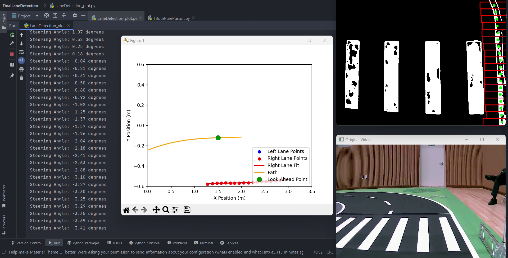

```markdown
# 🛣️ LaneFollower_WS

ROS Noetic 기반 **차선 인식 → 경로 생성 → Pure-Pursuit 제어** 파이프라인입니다.  
건국대학교 2024-여름방학 *제3회 자율주행 SW 경진대회*를 위해 작성한 코드와 데모를 업로드합니다.  
(Matplotlib 오프라인 검증 스크립트까지 함께 포함)

---

## 📁 프로젝트 구조


lane_follower_ws/
├── src/
│ └── lane_follower/
│ ├── launch/ #  3-노드 런치 파일
│ │ └── lane_follower.launch
│ ├── scripts/ #  Python 노드
│ │ ├── lane_detector.py # ① BEV + 차선 추출
│ │ ├── path_planner.py # ② 경로/Look-ahead 계산
│ │ └── pure_pursuit_ctrl.py # ③ 조향·스로틀 출력
│ ├── CMakeLists.txt
│ └── package.xml
└── demo/
└── lane_demo_offline.py # Matplotlib 데모 (ROS 미사용)
```

---
> `lane_demo_offline.py` 는 ROS 없이 비디오 파일을 읽어 **실시간 시각화**(차선·경로·Look-ahead·조향각 출력)를 확인할 때 사용합니다.

---

## 🚀 주요 기능

### ✅ 차선 인식 (LaneDetector)
* Bird-Eye 변환 & HLS Color Mask  
* 원형 오브젝트(신호등·표지판) 제거  
* 히스토그램 + 슬라이딩 윈도우로 좌/우 차선 픽셀 수집  
* **좌(1차)/우(3차) Poly-fit** 계수 `/lane/*_fit` 토픽 발행  
* BEV & 디버그 이미지 `/car/*_image` 토픽 발행

### ✅ 경로 생성 (PathPlanner)
* 우측 차선 기준 **차량 중심선** 함수 `P(x)` 계산  
* Look-ahead 거리 `x_la` (기본 0.85 m) 지점의 목표 좌표 산출  
* `/path/lookahead_point` 발행

### ✅ Pure-Pursuit 제어 (PurePursuitCtrl)
* Look-ahead 점으로부터 조향각 계산  
* 스로틀 0.8 (흔들림 확인용 상수) 발행  
* `/car/steering`, `/car/throttle` 토픽 사용

### ✅ 오프라인 Matplotlib 데모
* `demo/lane_demo_offline.py`  
  * 비디오 → BEVㆍ차선ㆍ경로ㆍLook-ahead를 Figure 로 실시간 출력  
  * Pure-Pursuit 조향각을 콘솔에 표시해서 **ROS 없어도 알고리즘 검증 가능**

---

## ⚙️ 사용 방법

### 🔧 빌드 (ROS Noetic)

```bash
cd ~/workspace/lane_follower_ws
catkin_make -DCMAKE_BUILD_TYPE=Release
source devel/setup.bash
```
- 소스 수정 시 설치 디렉토리에 즉시 반영되도록 심볼릭 링크로 설치하고, 최적화 빌드를 통해 실행 성능을 높이기 위해 catkin_make -DCMAKE_BUILD_TYPE=Release 사용

### 🚀 실행 예시

```bash
# 3-노드 전체 파이프라인
roslaunch lane_follower lane_follower.launch

# 개별 노드만 테스트하고 싶을 때
rosrun lane_follower lane_detector.py           # 카메라 → 차선
rosrun lane_follower path_planner.py            # 차선 → 경로
rosrun lane_follower pure_pursuit_ctrl.py       # 경로 → 제어

# 오프라인 Matplotlib 데모 (영상 파일 필요)
python3 demo/lane_demo_offline.py --video trackrecord4_2x.mp4
```

## 🎥 데모 영상

👉 [데모 영상 다운로드 (MP4)](https://github.com/imhyeonwoo/Sliding-Windows-Path-Planning-Pure-Pursuit/raw/main/videos/demo_lane_follower.mp4)

> 🔸 차선 인식 → 경로 생성 → Pure Pursuit 조향까지 전체 파이프라인 시연 영상입니다.

[](https://github.com/imhyeonwoo/Sliding-Windows-Path-Planning-Pure-Pursuit/raw/main/videos/demo_lane_follower.mp4)

## 영상 설명
- 파란·빨간 점 : 추출된 좌·우 차선 포인트
- 파란/빨간 선 : Poly-fit 차선
- 주황색 선 : 차량 중심 경로 P(x)
- 초록 원 : Look-ahead 점 (0.85 m)
- 콘솔 로그 : 실시간 조향각(°) 출력

## 🛠️ 개발 환경

| 항목            | 버전/도구               |
|-----------------|------------------------|
| OS              | Ubuntu 20.04 LTS           |
| ROS             | ROS1 Noetic            |
| 언어            | Python 3.8 / C++14    |
| 라이브러리            | OpenCV 4.9, NumPy, Matplotlib    |

---

