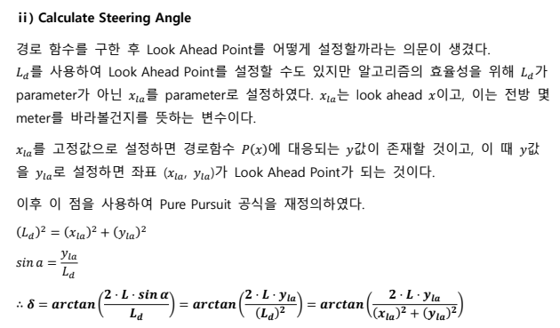
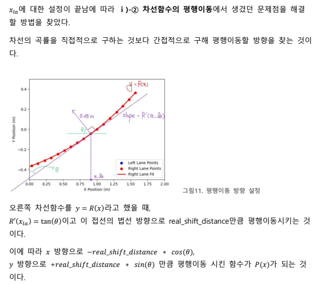

#  LaneFollower_WS

A **lane detection → path generation → Pure-Pursuit control** pipeline based on ROS Noetic.  
This repository contains the code and demo for the *3rd Autonomous Driving Software Competition(제3회 미래형자동차 자율주행 SW 경진대회)* during the 2024 summer vacation at Konkuk University.  
(Includes offline verification scripts using Matplotlib.)

---
```markdown

## Project Structure


lane_follower_ws/
├── src/
│ └── lane_follower/
│ ├── launch/ #  3-node launch file
│ │ └── lane_follower.launch
│ ├── scripts/ #  Python nodes
│ │ ├── lane_detector.py # ① BEV +  lane data extraction
│ │ ├── path_planner.py # ② Path and look-ahead point calculation
│ │ └── pure_pursuit_ctrl.py # ③ Steering and throttle output
│ ├── CMakeLists.txt
│ └── package.xml
└── demo/
└── lane_demo_offline.py # Matplotlib demo (no ROS required)
```

---
> `lane_demo_offline.py` reads a video file and performs **real-time visualization** of the lane, path, look-ahead point, and steering angle **without ROS**.

---

## Main Features

### (1) Lane Detection (LaneDetector)
* Bird's-eye view transformation & HLS color masking  
* Removes circular objects (traffic lights, signs, flower markers)  
* Uses histogram + sliding window to detect left/right lane pixels  
* Publishes **left (1st-order) / right (3rd-order) poly-fit coefficients** on `/lane/*_fit` topics  
* Publishes BEV & debug images on `/car/*_image` topics  

### (2) Path Generation (PathPlanner)
* Calculates the **vehicle center path function** `P(x)` based on the right lane  
* Computes target coordinates at look-ahead distance `x_la` (default 0.85 m)  
* Publishes `/path/lookahead_point`  
* For efficiency, sets `x_ld` instead of ld in the Pure-Pursuit node and uses `P'(x_ld)` during calculation  

### (3) Pure-Pursuit Control (PurePursuitCtrl)
* Calculates steering angle based on the look-ahead point  
* Publishes throttle (fixed at 0.8 to observe lateral motion clearly)  
* Uses `/car/steering` and `/car/throttle` topics 

### (4) Offline Matplotlib Demo
* `demo/lane_demo_offline.py`  
  * Reads a video → displays BEV, lane, path, and look-ahead point in a matplotlib figure in real-time  
  * Prints Pure-Pursuit steering angles to the console → **algorithm verification without ROS**

---

##  Core Algorithm – Calculate Steering Angle

The following describes the process of calculating the steering angle from the look-ahead point in Pure Pursuit.



- Accordingly, in sections with high curvature, y_la  decreases while x_la remains constant, resulting in a shorter look-ahead distance.
- This enables the successful implementation of a dynamic look-ahead distance that adjusts according to the curvature of the road.
---

##  Path Planning(Shifting) – Path Shift

The target path is shifted based on the slope of the detected lane function and its normal vector to align with the vehicle's centerline.



---

##  How to Use

###  Build (ROS Noetic)

```bash
cd ~/workspace/lane_follower_ws
catkin_make -DCMAKE_BUILD_TYPE=Release
source devel/setup.bash
```
- catkin_make -DCMAKE_BUILD_TYPE=Release builds the project with optimization enabled for better runtime performance and reflects source code changes immediately.

###  Example Execution

```bash
# Full 3-node pipeline
roslaunch lane_follower lane_follower.launch

# Test individual nodes
rosrun lane_follower lane_detector.py           # Camera → Lane detection
rosrun lane_follower path_planner.py            # Lane → Path generation
rosrun lane_follower pure_pursuit_ctrl.py       # Path → Control

# Offline Matplotlib demo (requires video file)
python3 demo/lane_demo_offline.py --video trackrecord4_2x.mp4
```

##  Demo Video

<p align="center">
  <br>
  <span style="font-size:20px; font-weight:bold;">Lane Follower Visualization</span>
</p>

<p>
  This GIF visualizes the <b>Lane Detection–Path Generation–Pure Pursuit Control Pipeline</b>. 
  The pipeline integrates <i>sliding window–based lane detection</i>, <i>polynomial path fitting</i>, 
  and <b>Pure Pursuit steering control</b> to demonstrate end-to-end autonomous path tracking.
</p>

<ul>
  <li><b>Blue/Red Dots:</b> Detected left/right lane points using the Sliding Window method</li>
  <li><b>Blue/Red Curves:</b> Polynomial-fitted lane boundaries</li>
  <li><b>Yellow Curve:</b> Vehicle center path function P(x)</li>
  <li><b>Green Circle:</b> Look-ahead point (x<sub>la</sub> = 0.85 m, y<sub>la</sub> = P(x<sub>la</sub>))</li>
  <li><b>Console Log:</b> Real-time steering angle output (°)</li>
</ul>

##  Development Environment

| Item            | Version/Tool             |
|-----------------|------------------------|
| OS              | Ubuntu 20.04 LTS           |
| ROS             | ROS1 Noetic            |
| Programming Lang	            | Python 3.8 / C++14    |
| Libraries            | OpenCV 4.9, NumPy, Matplotlib    |

---

